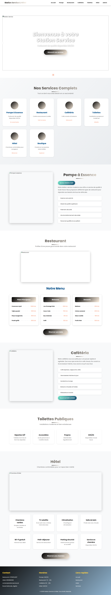
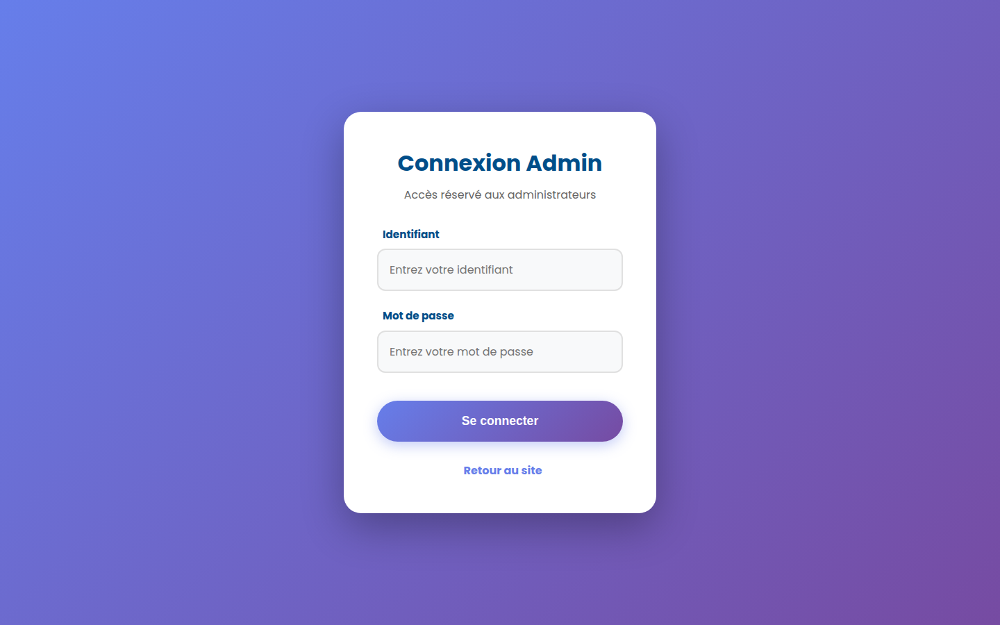
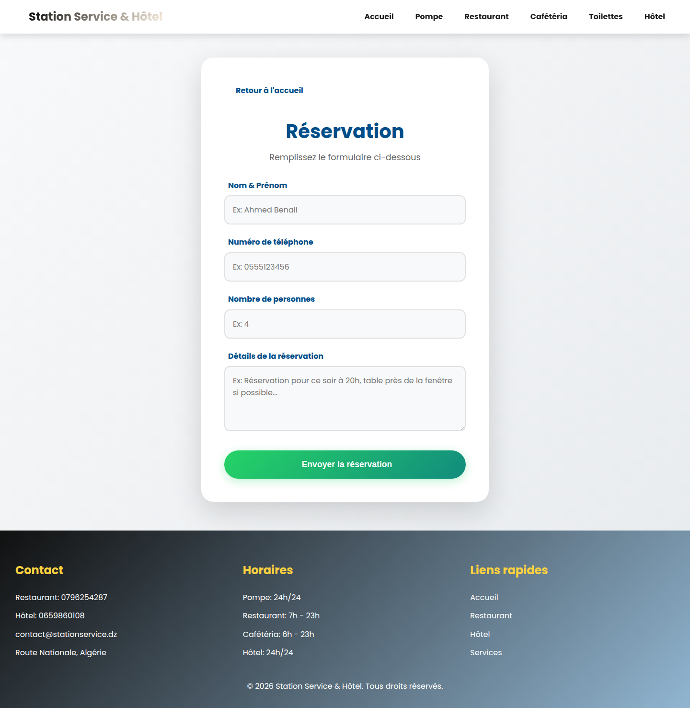

# Station Service & Hôtel

Application web de gestion pour une station-service et un hôtel : réservations, menu du restaurant, gestion des utilisateurs et des administrateurs.

  

## Aperçu

Ce projet permet de gérer en ligne les différents services d'une station-service (pompe à essence, restaurant, cafétéria, toilettes, boutique) ainsi que d'un hôtel attenant. Il propose un site public pour les clients et un espace d'administration protégé pour le personnel.

## Captures d'écran

### Page d'accueil


### Page de connexion admin


### Page de réservation


> Les captures des tableaux de bord admin et super-admin ne sont pas incluses ici car elles nécessitent d'être connecté avec un compte valide. Ajoute-les toi-même une fois connecté sur ton environnement local.

## Fonctionnalités

- Site public : présentation des services, menu du restaurant/cafétéria, formulaire de réservation
- Espace admin : gestion des réservations, du menu, des utilisateurs
- Espace super-admin : gestion des comptes administrateurs et approbations
- Authentification par token (stocké côté session), avec expiration

## Stack technique

- **Backend** : PHP 7.4+ (API REST simple, sans framework)
- **Base de données** : MySQL 5.7+
- **Frontend** : HTML / CSS / JavaScript vanilla

## Structure du projet

```
station-de-service/
├── api/            # Endpoints PHP (auth, admins, users, menu, approvals)
├── config/         # Connexion base de données + script SQL d'initialisation
├── public/         # Pages HTML, CSS et JS du site
└── INSTALLATION.md # Guide d'installation détaillé
```

## Installation rapide

Voir [INSTALLATION.md](./INSTALLATION.md) pour le guide complet.

```bash
git clone https://github.com/ouahcenechenane/station-de-service.git
cd station-de-service
# Importer config/init_database.sql dans MySQL
# Configurer config/database.php avec tes identifiants
# Lancer un serveur PHP local, ex :
php -S localhost:8000
```

## Licence

Projet personnel — libre d'utilisation à des fins d'apprentissage.
